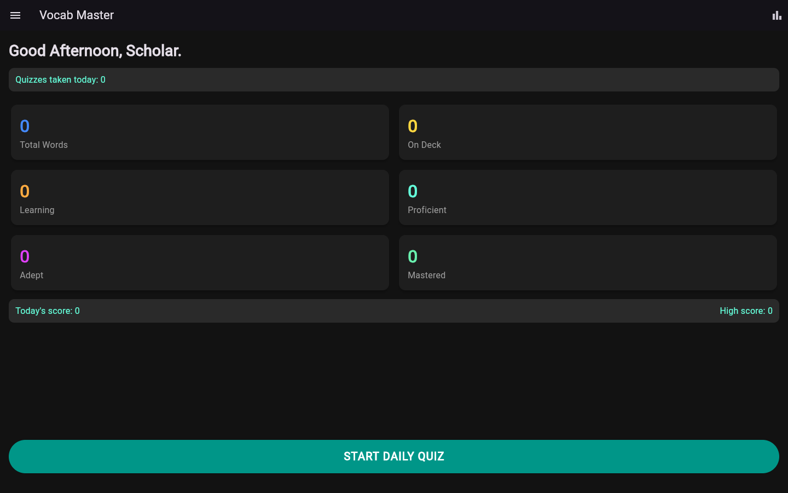
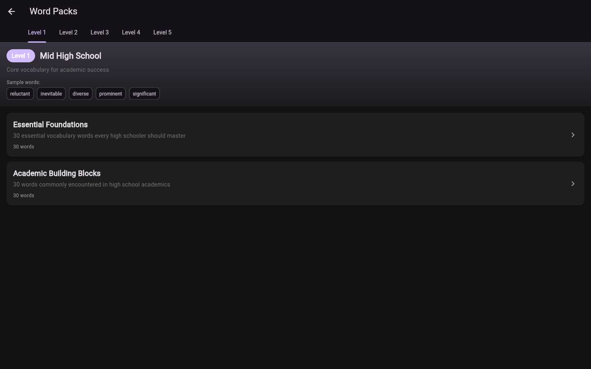

# Word Quizzer

Flutter-powered, offline-first vocabulary trainer. The primary experience is an installable PWA that runs on Android and iOS, backed by bryanlangley.org sync services by default.

## Screenshots
<table>
  <tr>
    <td>
      
    </td>
  </tr>
  <tr>
    <td>
      
    </td>
  </tr>
</table>

## Two ways to run it
### 1) Hosted PWA (recommended)
- Open https://word-quizzer.bryanlangley.org in a mobile or desktop browser.
- Install to your home screen for an app-like experience.
- Syncs by default to bryanlangley.org infrastructure (`https://word-quizzer-api.bryanlangley.org`).

### 2) Self-hosted / offline
- Run the Flutter web app locally (fully offline if you want):
```bash
cd mobile_app
flutter pub get
flutter run -d web-server --web-port 8080
```
- Or build static files for any web host:
```bash
flutter build web
```
- You can point the app at your own sync server in Settings, or keep it offline.

## What it does
- Import Kindle `vocab.db` directly in the PWA.
- Triage words by status and priority tier.
- Enrich new words with definitions, distractors, and examples.
- Run daily quizzes with streaks and lightweight analytics.
- Use built-in word packs and onboarding to seed new vocab.

## Repo layout
- `mobile_app/` Flutter PWA + Android build
- `desktop_admin/` Legacy Streamlit admin console (self-hosters only)
- `functional_spec.md` Product behavior and data model

## Legacy Streamlit admin console (optional)
This is kept for self-hosters who prefer the original desktop workflow. It is not the primary product anymore.

```bash
cd desktop_admin
python3 -m venv .venv
source .venv/bin/activate
pip install -r requirements.txt
```

Create `desktop_admin/.env`:
```
OPENROUTER_API_KEY=your_key_here
```

Run the admin:
```bash
streamlit run app.py
```

## Notes
- The local SQLite database is the source of truth for self-hosted workflows and is intentionally not checked in.
