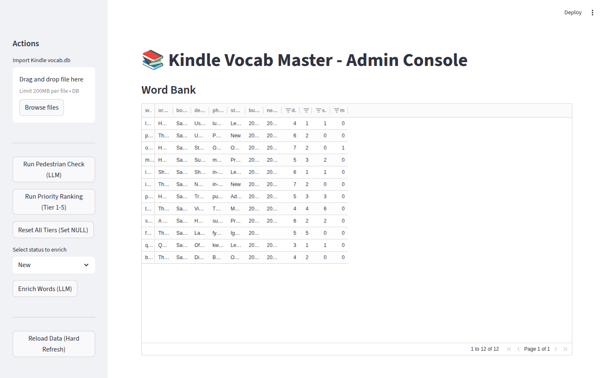
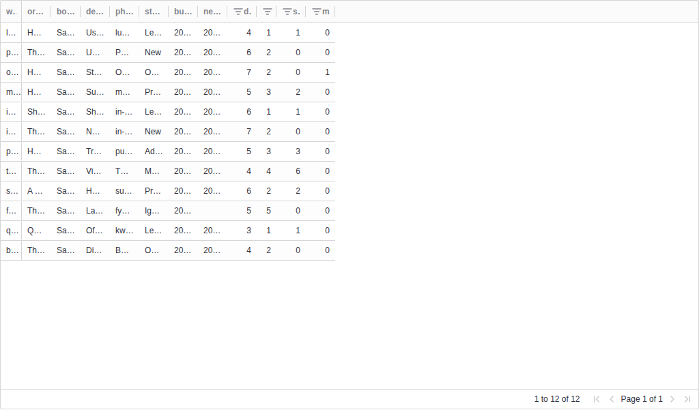

# Word Quizzer

Offline-first vocabulary trainer built around a single SQLite source of truth. Use the Streamlit admin console to import and curate words, then study daily in the Flutter Android app.

## What it does
- Import Kindle `vocab.db` exports into `vocab_master.db`.
- Rank words by priority tier and triage them by status.
- Enrich new words with definitions, distractors, and examples.
- Build a daily deck using spaced repetition + tiered new words.
- Track streaks and performance analytics on-device.

## Screenshots
<table>
  <tr>
    <td>
      
    </td>
  </tr>
  <tr>
    <td>
      
    </td>
  </tr>
</table>

Screenshots use a small sample dataset.

## Core workflow
1. Import a Kindle `vocab.db` file.
2. Rank words into priority tiers (1-5) and triage their learning status.
3. Enrich new words with LLM-powered definitions, distractors, and examples.
4. Sync `vocab_master.db` to Android and run daily quizzes.

## Repo layout
- `desktop_admin/` Streamlit admin UI + LLM enrichment
- `mobile_app/` Flutter Android app
- `functional_spec.md` Product behavior and data model

## Desktop admin setup
```bash
cd desktop_admin
python3 -m venv .venv
source .venv/bin/activate
pip install -r requirements.txt
```

Create `desktop_admin/.env`:
```
OPENROUTER_API_KEY=your_key_here
```

Run the admin:
```bash
streamlit run app.py
```

## Mobile app setup
```bash
cd mobile_app
flutter pub get
flutter run
```

## Database sync to Android (debug)
The app reads `vocab_master.db` from the Android app data directory. For debug builds you can push a fresh DB:
```bash
adb shell am force-stop com.example.vocab_master
adb push /path/to/vocab_master.db /data/local/tmp/vocab_master.db
adb shell run-as com.example.vocab_master cp /data/local/tmp/vocab_master.db \
  /data/data/com.example.vocab_master/databases/vocab_master.db
```

## Notes
- The SQLite database is the source of truth and is intentionally not checked in.
- LLM enrichment uses OpenRouter; set `OPENROUTER_API_KEY` before running.
